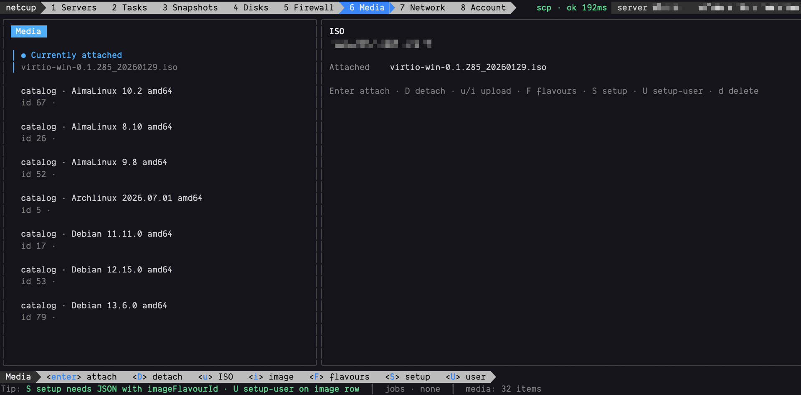

# netcup-cli

Go CLI for the [netcup](https://www.netcup.com/) **SCP (Server Control Panel) REST API**.



## Install

### Homebrew

```bash
brew install brandonkramer/tap/netcup
```

### Go

Requires a recent Go toolchain (see `go.mod`).

```bash
go install github.com/brandonkramer/netcup-cli/cmd/netcup@latest
```

### GitHub Releases

Download a prebuilt archive from [Releases](https://github.com/brandonkramer/netcup-cli/releases) (`darwin`/`linux`/`windows`, `amd64`/`arm64`), extract, and put `netcup` on your `PATH`.

### From source

```bash
git clone https://github.com/brandonkramer/netcup-cli.git
cd netcup-cli
make build
# optional: install onto PATH
cp bin/netcup "$(go env GOPATH)/bin/netcup"
```

### Update

```bash
netcup update              # detect Homebrew / go install / Releases
netcup update --dry-run    # print the plan only
netcup update --method go  # force go install
```

Shell completions:

```bash
netcup completion zsh > "${fpath[1]}/_netcup"   # zsh example
netcup completion bash|fish|powershell
```

## Quick start

```bash
netcup auth login
netcup ping
netcup servers list
netcup servers get -s <id|name|nickname|ip>
netcup servers start -s <selector>
```

On an interactive TTY, bare `netcup` (no subcommand) opens the ops TUI (servers, tasks, snapshots, disks, firewall, media, network, account). Same via `netcup tui`. Non-TTY / piped use still shows help; scripting stays on subcommands.

Config and credentials live under `~/.config/netcup` (override with `--config-dir` / `NETCUP_CONFIG_DIR`). Profiles use `--profile` / `NETCUP_PROFILE` (default `default`). Profile names must start and end with an alphanumeric; `.`, `_`, and `-` are allowed in the middle (not `.` / `..` or path separators).

## Global flags

| Flag / env | Meaning |
|------------|---------|
| `--version` | print version and exit |
| `--format` / `NETCUP_FORMAT` | `table` (TTY default), `json`, `jsonl`, `yaml`, `brief` |
| `--json` | alias for `--format json` |
| `-y` / `--yes` | skip destructive confirmations |
| `--no-wait` | return TaskInfo immediately on HTTP 202 |
| `--wait-timeout` | default `30m` |
| `--poll-interval` | default `2s` |
| `--no-cache` | disable read cache |
| `--cache-ttl` | override cache TTL for this process |
| `--profile` / `NETCUP_PROFILE` | credential profile |
| `--user-id` | override SCP userId (positive integer; from JWT `sub` by default) |
| `-s` / `--server` | server selector: id, name, nickname, or IPv4 |
| `-q` / `--quiet` | suppress non-essential stderr |
| `-v` / `--verbose` | verbose logging (tokens redacted) |
| `--full` | include full API objects in curated views |
| `--config-dir` / `NETCUP_CONFIG_DIR` | default `~/.config/netcup` |
| `NETCUP_BASE_URL` | default `https://www.servercontrolpanel.de` |
| `NO_COLOR` | disable color |

Non-TTY stdout defaults to `--format json`. Agents should parse the JSON envelope on stdout.

Destructive commands refuse non-interactive use without `-y` (exit `2`).

### Exit codes

| Code | Meaning |
|------|---------|
| 0 | Success |
| 1 | API / task error |
| 2 | Usage / confirmation required |
| 3 | Auth required or refresh failed |
| 4 | Task wait timeout |
| 5 | Not found |
| 130 | Interrupted (SIGINT) |

---

## Commands

### Auth

```text
netcup auth login [--no-browser] [--no-save]
netcup auth logout [--revoke]
netcup auth status
netcup auth whoami
netcup auth refresh
```

Device-code OIDC login (`client_id=scp`, scopes `openid offline_access`). Refresh token stored at `credentials-<profile>.json` (mode `0600`).

### Misc

```text
netcup                  # interactive TUI (TTY only); alias: netcup tui
netcup update [--dry-run] [--method homebrew|go|manual]
netcup ping
netcup maintenance
netcup cache stats
netcup cache clear [prefix]
netcup spec show
netcup spec update          # writes openapi.json; then: make generate
netcup spec mcp             # docs MCP proxy
netcup completion bash|zsh|fish|powershell
```

**TUI:** tabs `1` Servers · `2` Tasks · `3` Snapshots · `4` Disks · `5` Firewall · `6` Media · `7` Network · `8` Account (or `tab` / `shift+tab`). Opens without credentials and shows an auth gate (`l` device login, `r` retry session, `q` quit). Top chrome includes an SCP ping/maintenance chip. The powerline bottom bar shows active keys, jobs, and a contextual tip. A selected server is carried into server-scoped tabs. Async actions that return HTTP 202 without a task UUID show as `UNTRACKED` (refresh to verify).

| Tab | Keys |
|-----|------|
| Servers | `j/k` · `space` multi-select · `/` filter · `enter` reload detail · `pgup`/`pgdn` detail scroll · `s/t/r` start/stop/reboot · `P` poweroff · `x` reset · `u` suspend · `h`/`n` hostname/nickname · `A` autostart · `U` UEFI · `b` boot order · `K` keyboard · `g` guest agent · `e`/`d` rescue enable/disable · `m` metrics · `L` logs · `O` storage optimize · `G` GPU driver · `y` copy id · `R` refresh · `a` clear |
| Metrics (from Servers `m`) | `c/d/n/p` cpu/disk/network/packets · `h` cycle hours (1→6→24→168) · `R` refresh · `esc` back to server detail |
| Tasks | `c` cancel · `R` refresh |
| Snapshots | `enter` detail · `c` create · `D` dry-run · `r` revert · `d` delete · `x` export · `R` refresh |
| Disks | `enter` detail · `v` supported drivers · `s` set driver · `f` format (confirm) · `R` refresh |
| Firewall | `enter` get selected MAC/policy · `r` reapply · `c` restore copied policies · `s` assign JSON to MAC · `S`/`H` create SSH/HTTP policy presets (library only; not applied) · `p` policies · `n` create policy · `e` update policy · `d` delete policy |
| Media | `enter` attach (+boot CDROM) · `D` detach · `u`/`i` upload ISO/image path · `F` flavours · `S` image setup (JSON/`@file`, confirm) · `U` setup-user on selected image · `d` delete · `R` refresh |
| Network | NICs, failover IPv4/IPv6, VLANs · `enter` detail · `c` create VLAN NIC (`vlanId [driver]`) · `e` rename VLAN · `d` delete NIC · `r` set rDNS · `g` get rDNS · `x` clear rDNS · `f` route failover (v4/v6 from selection, `id targetServerId`) · `R` refresh |
| Account | user profile + SSH keys · `k` list keys · `a` add (`name\|public key`) · `d` delete · `L` logs · `R` refresh |

Parallel jobs show in the bottom bar. `q` / `ctrl+c` quits.

### Servers

```text
netcup servers list [--q] [--name] [--ip] [--sort] [--limit] [--offset] [--firewall-policy-id]
netcup servers get [selector]
netcup servers start|stop|poweroff|reboot|reset|suspend [selector]
netcup servers storage-optimize [--disk NAME]… [--start-after] [selector]
netcup servers gpu-driver [selector]
netcup servers guest-agent [selector]
netcup servers guest-agent status [selector]
netcup servers logs [--limit] [--offset] [selector]
netcup servers rescue status|enable|disable [selector]

netcup servers set hostname <value> [selector]
netcup servers set nickname <value> [selector]
netcup servers set uefi <true|false> [selector]
netcup servers set bootorder <CDROM,HDD,NETWORK> [selector]
netcup servers set root-password [selector] [--password-file PATH|-]
netcup servers set autostart <true|false> [selector]
netcup servers set os-optimization <LINUX|WINDOWS|BSD|LINUX_LEGACY|UNKNOWN> [selector]
netcup servers set cpu-topology <sockets>,<coresPerSocket> [selector]
netcup servers set keyboard-layout <value> [selector]
```

Server selector (`-s` or positional): numeric **id**, **name**, **nickname**, or **IPv4**. Prefer id in scripts.

`servers set root-password` never takes the password on the argv. Use `--password-file` (or `-` for stdin), or an interactive TTY prompt.

Power mutations and many other writes return HTTP 202; the CLI waits for the task by default (retries transient 429/5xx while polling).

### Disks

```text
netcup disks list [selector]
netcup disks get <diskName> [selector]
netcup disks drivers [selector]
netcup disks set-driver <driver> [selector]
netcup disks format <diskName> [selector]    # destructive
```

### Snapshots

```text
netcup snapshots list [selector]
netcup snapshots get <name> [selector]
netcup snapshots create --name <name> [selector]
netcup snapshots dry-run [selector]
netcup snapshots delete <name> [selector]    # destructive
netcup snapshots export <name> [selector]
netcup snapshots revert <name> [selector]    # destructive
```

### ISO (attached) & ISOs (library)

```text
netcup iso get|detach [selector]
netcup iso attach [--iso-id N] [--user-iso NAME] [--boot-cdrom] [selector]
netcup iso available [selector]

netcup isos list
netcup isos upload <file> [--key NAME] [--part-size BYTES]
netcup isos delete <key>                     # destructive
netcup isos download-url <key>
netcup isos prepare-upload <key> [--multipart]
netcup isos part-url <key> <uploadId> <partNumber>
netcup isos complete-upload <key> <uploadId> --body '[{...}]'
```

### Images

```text
netcup images flavours [selector]
netcup images list
netcup images setup [selector] --flavour-id N [flags]   # destructive
netcup images setup-user [selector] --name <key>
netcup images upload <file> [--key NAME]
netcup images delete <key>                   # destructive
netcup images download-url <key>
netcup images prepare-upload|part-url|complete-upload …
```

`images setup` flags include `--flavour-id`, `--hostname`, `--disk`, `--locale`, `--timezone`, `--user`, `--password-file`, `--ssh-key-id`, `--ssh-password-auth`, `--root-full-disk`, `--email`, `--custom-script`, or `--body @file.json` (body overrides flags). Additional-user passwords use `--password-file` (or `-` for stdin), never argv.

### Networking

```text
netcup nics list|get <mac>|delete <mac> [selector]
netcup nics create --vlan-id N [--driver VIRTIO] [selector]
netcup nics update <mac> --driver <DRIVER> [selector]

netcup rdns ipv4 get|set|delete …
netcup rdns ipv6 get|set|delete …

netcup failover ipv4 list
netcup failover ipv4 route <id> <serverId>
netcup failover ipv6 list
netcup failover ipv6 route <id> <serverId>

netcup vlans list|get <vlanId>|get-global <vlanId>
netcup vlans update <vlanId> --name <name>
```

### Firewall

```text
netcup firewall get <mac> [selector]
netcup firewall set <mac> [selector] [--active] [--user-policy ID]… [--copied-policy ID]… [--body]
netcup firewall reapply <mac> [selector]
netcup firewall restore-copied <mac> [selector]

netcup firewall-policies list|get <id>|delete <id>
netcup firewall-policies create --name NAME [--description] [--body]
netcup firewall-policies update <id> --name NAME [--description] [--body]
```

### Metrics, tasks, users, SSH keys

```text
netcup metrics cpu|disk|network|packets [--hours N] [selector]   # never cached

netcup tasks list [--q] [--state] [--server-id] [--limit] [--offset]
netcup tasks get <uuid>
netcup tasks cancel <uuid>

netcup users get
netcup users logs [--limit] [--offset]
netcup users update [--language] [--timezone] [--password-file] [--old-password-file]
                    [--passwordless] [--secure-mode] [--show-nickname]
                    [--api-ip-restrictions] | --body

netcup ssh-keys list
netcup ssh-keys add --name NAME --key '…' | --key-file PATH
netcup ssh-keys delete <id>
```

### Escape hatches (full API)

Every OpenAPI operation is reachable even without a curated verb:

```text
netcup api METHOD PATH [--query k=v]… [--header 'Name: value']… [--body JSON|@file|-]
netcup call OPERATION_HINT [--path k=v]… [--query k=v]… [--body] [--dry-run]
netcup endpoints [--filter TEXT] [--tag TAG]
netcup describe PATH_OR_OPERATION
```

Examples:

```bash
netcup call "GET /api/v1/servers" --dry-run
netcup call "snapshot create" --path serverId=123 --body '{"name":"x"}' -y
netcup api GET /api/v1/servers --query q=web
netcup endpoints --filter snapshot
netcup describe "iso attach"
```

`call` resolves against the pinned/local OpenAPI (path, `METHOD path`, or text hint). `--server` can fill `{serverId}`; `{userId}` is filled from the token when needed.

---

## Common workflows

**Power cycle**

```bash
netcup servers stop -s myvps
netcup servers start -s myvps
# hard poweroff / reset require confirmation or -y
netcup servers poweroff -s myvps -y
```

**Snapshot before risk**

```bash
netcup snapshots dry-run -s myvps
netcup snapshots create --name before-change -s myvps
```

**Attach Windows ISO**

```bash
netcup isos upload ./Win11.iso --key win11.iso
netcup iso attach --user-iso win11.iso --boot-cdrom -s myvps
netcup servers reboot -s myvps
```

**Reimage**

```bash
netcup images flavours -s myvps
netcup images setup --flavour-id <id> --hostname myhost -s myvps -y
```

**Agent / CI**

```bash
netcup servers list --format json
netcup servers start -s 123456 -y --format json
# non-TTY already defaults to json
```

**Rich writes with `--body`**

Curated flags cover common fields; for full request payloads use `--body` (inline JSON, `@file`, or `-` for stdin):

```bash
netcup firewall set aa:bb:cc:dd:ee:ff -s myvps --body @rules.json -y
netcup users update --body '{"language":"en","timezone":"Europe/Berlin"}'
netcup call "firewall-policies create" --body @policy.json -y
```

---

## Agent MCP

This repository is also a **Codex / Cursor / Claude** plugin. MCP tools shell out to `netcup --format json` via `netcup mcp`.

**Prereqs:** `netcup` on `PATH` (`brew` / `go install` / Releases / `make build`) and `netcup auth login` once.

### One-shot host wiring

```bash
netcup install-mcp                     # Claude + Cursor + Codex, --scope user
netcup install-mcp --scope project     # project-local Claude + Cursor mcp.json
netcup install-mcp --host claude --scope local
netcup install-mcp --dry-run
```

Uses a git checkout when present; otherwise materializes plugin files into `~/.config/netcup/plugin`. Override with `--root` / `NETCUP_PLUGIN_ROOT`. Re-run after upgrading `netcup` (or `git pull` in a checkout).

| Host | What `install-mcp` does |
|------|-------------------------|
| Claude | Managed marketplace + `claude plugin install netcup@netcup-local` |
| Cursor | Merges `netcup` → `netcup mcp` into mcp.json |
| Codex | Writes local Codex catalog + `codex plugin marketplace add` / `plugin add` |

Manual stdio smoke: `netcup mcp` (or `./bin/netcup mcp` from a checkout).

**Tool layers:** curated tools for servers / power / tasks / ISO / firewall get; full CLI reach via `netcup_endpoints` → `netcup_describe` → `netcup_call`, or `netcup_cli` for allowlisted argv. Destructive calls need `confirm=true`. Blocked: TUI, `auth login`, secret-on-argv. Skill: [`skills/netcup/SKILL.md`](./skills/netcup/SKILL.md).

---

## Develop

```bash
make generate   # regenerate client from openapi.json
make build      # bin/netcup
make coverage   # assert all OpenAPI ops are mapped
go test ./...
```

Pinned OpenAPI: [`openapi.json`](./openapi.json).

### Keeping up with API drift

After `netcup spec update` (refreshes `openapi.json`), run `make generate` so the typed client matches the new spec.

New or changed operations work immediately via `api` / `call` / `endpoints` / `describe`. Curated verbs are added separately; until then, use the escape hatches. `make coverage` / `TestCoverageGate` fails if the coverage map drifts after regenerate (new ops need a map entry — curated command or `api`/`call`).
